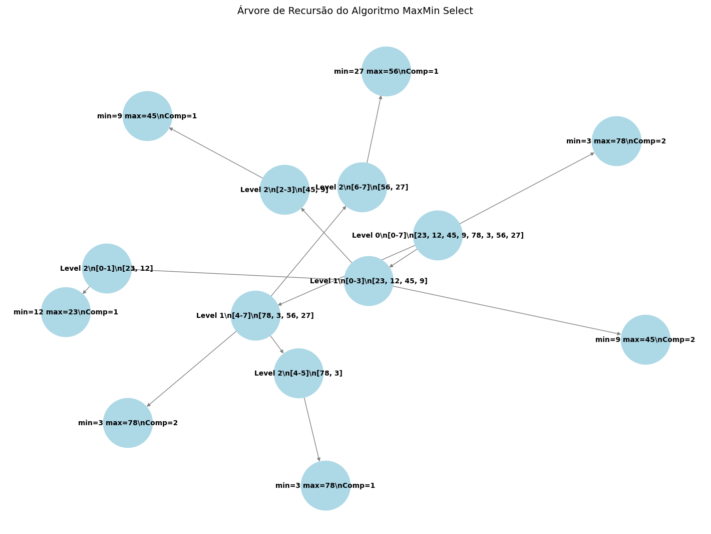
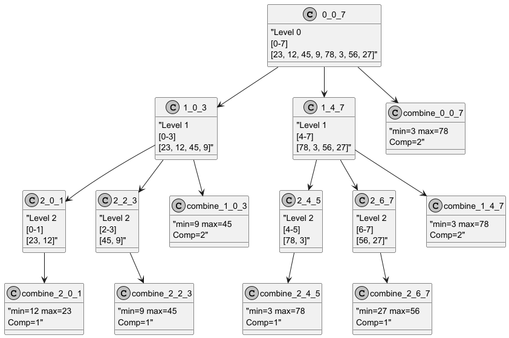

# Trabalho Individual 2 - MaxMin Select

## Descrição do Projeto

Este projeto implementa o algoritmo **MaxMin Select** em Python, que utiliza a técnica de divisão e conquista para encontrar simultaneamente o maior e o menor elementos de uma sequência de números. O algoritmo divide recursivamente a sequência em duas partes, resolve os subproblemas e combina os resultados para determinar os valores mínimo e máximo. Dois diagramas da árvore de recursão são gerados automaticamente: um em formato PNG e outro em formato PlantUML (.puml), que pode ser renderizado online.

### Lógica do Algoritmo (Explicação Linha a Linha)

- **Função `maxmin_select(arr, low, high, G=None, parent=None, level=0)`**:
  - Recebe a lista `arr`, o índice inicial `low`, o índice final `high`, um grafo `G` (para os diagramas), o nó pai `parent` e o nível `level`.
  - **Linha 12-14**: Inicializa o grafo `G` como um `DiGraph` do `networkx` se não for fornecido.
  - **Linha 17-19**: Cria um nó no grafo com um rótulo que inclui o nível da recursão, o intervalo `[low-high]` e os elementos do array nesse intervalo.
  - **Linha 20-21**: Conecta o nó atual ao nó pai, se existir, para formar a árvore de recursão.
  - **Caso base 1 (Linha 24-25)**: Se `low == high` (um elemento), retorna o mesmo valor como mínimo e máximo.
  - **Caso base 2 (Linha 28-36)**: Se `high == low + 1` (dois elementos), realiza 1 comparação para determinar o mínimo e o máximo, adiciona um nó de combinação ao grafo com os resultados e o número de comparações, e retorna os valores.
  - **Recursão (Linha 39-50)**: 
    - Calcula o ponto médio `mid = (low + high) // 2`.
    - Chama a função recursivamente para a metade esquerda (`low` até `mid`) e direita (`mid + 1` até `high`), atualizando o grafo.
    - Combina os resultados usando `min()` para o menor valor e `max()` para o maior valor entre os subproblemas, realizando 2 comparações.
    - Adiciona um nó de combinação ao grafo com os resultados e o número de comparações.
- **Função `generate_puml(G, filename)`**:
  - Gera um arquivo `.puml` para visualização no PlantUML, com rótulos detalhados e separação ajustada entre nós e níveis.
- **Função `main()`**:
  - Testa o algoritmo com uma sequência de 8 números (`[23, 12, 45, 9, 78, 3, 56, 27]`), exibe os resultados no console e gera dois diagramas: um PNG (`diagrama_maxmin.png`) e um PlantUML (`diagrama_maxmin.puml`), ambos salvos na pasta `assets`.

## Como Executar o Projeto

1. Certifique-se de ter o Python 3.x instalado em seu ambiente.
2. Instale as dependências necessárias:
   ```bash
   pip install networkx matplotlib
   ```
3. Clone este repositório:
   ```bash
   git clone https://github.com/RafaelPChequer/MaxMin-Exercise.git
   ```
4. Navegue até o diretório do projeto:
   ```bash
   cd MaxMin-Exercise
   ```
5. Execute o programa:
   ```bash
   python main.py
   ```
6. O programa exibirá a sequência de entrada, o menor e o maior elementos no console, e salvará os diagramas da árvore de recursão em:
   - `assets/diagrama_maxmin.png` (formato PNG).
   - `assets/diagrama_maxmin.puml` (formato PlantUML, que pode ser renderizado em [PlantUML Online](http://www.plantuml.com/plantuml)).

## Relatório Técnico

### Análise da Complexidade Assintótica pelo Método de Contagem de Operações

O algoritmo MaxMin Select utiliza divisão e conquista, dividindo a sequência em duas partes em cada chamada recursiva. Vamos contar o número de comparações:

- **Caso base (1 elemento)**: 0 comparações.
- **Caso base (2 elementos)**: 1 comparação.
- **Recursão**: 
  - Para \( n \) elementos, o problema é dividido em dois subproblemas de tamanho \( n/2 \).
  - Na combinação, são feitas 2 comparações: uma para o mínimo (`min(min1, min2)`) e outra para o máximo (`max(max1, max2)`).
- **Recorrência**: \( T(n) = 2T(n/2) + 2 \).

Para calcular o número total de comparações, consideremos o exemplo com \( n = 8 \) (como no código):
- **Nível 0**: 1 chamada para `[0-7]`, 0 comparações (divisão).
- **Nível 1**: 2 chamadas (`[0-3]` e `[4-7]`), 2 subproblemas cada, 2 comparações na combinação por subproblema: \( 2 \times 2 = 4 \) comparações.
- **Nível 2**: 4 chamadas (`[0-1]`, `[2-3]`, `[4-5]`, `[6-7]`), cada uma com 2 elementos, 1 comparação por subproblema: \( 4 \times 1 = 4 \) comparações.
- **Total**: \( 4 + 4 = 8 \) comparações.

Generalizando para \( n \) elementos:
- A árvore de recursão tem \( \log_2 n \) níveis.
- No último nível, há \( n/2 \) subproblemas com 2 elementos cada, totalizando \( n/2 \) comparações.
- Nos níveis anteriores, há \( n/2 \) combinações no total (cada uma com 2 comparações).

O número total de comparações é:
\[
\frac{n}{2} + 2 \times \frac{n}{2} = \frac{n}{2} + n = \frac{3n}{2}
\]
Portanto, a complexidade temporal é \( O(n) \), pois o número de comparações é linear em relação a \( n \).

### Análise da Complexidade Assintótica pelo Teorema Mestre

A recorrência do algoritmo é:
\[ T(n) = 2T(n/2) + O(1) \]

1. **Identifique \( a \), \( b \) e \( f(n) \)**:
   - \( a = 2 \) (número de subproblemas).
   - \( b = 2 \) (fator de redução do tamanho do problema).
   - \( f(n) = O(1) \) (custo da combinação, 2 comparações constantes).

2. **Calcule \( \log_b a \)**:
   - \( \log_2 2 = 1 \), então \( p = 1 \).

3. **Determine o caso do Teorema Mestre**:
   - Comparar \( f(n) = O(1) \) com \( n^p = n^1 = O(n) \).
   - \( O(1) = O(n^{1-\epsilon}) \) para \( \epsilon > 0 \) (ex.: \( \epsilon = 0.5 \), \( n^{0.5} \)).
   - Isso satisfaz o **Caso 1**: \( f(n) = O(n^{p-\epsilon}) \) para algum \( \epsilon > 0 \).

4. **Solução assintótica**:
   - Pelo Caso 1 do Teorema Mestre: \( T(n) = O(n^p) = O(n^1) = O(n) \).

### Conclusão

Ambas as análises (contagem de operações e Teorema Mestre) confirmam que a complexidade temporal do MaxMin Select é \( O(n) \), o que é mais eficiente que a abordagem ingênua (\( O(n) \) com 2n comparações separadas).

## Diagrama Visual (Ponto Extra)

Dois diagramas ilustrando a recursão foram criados automaticamente pelo código e estão disponíveis em:
- **PNG**: `assets/diagrama_maxmin.png`.
- **PlantUML**: `assets/diagrama_maxmin_puml.png`.

Eles mostram:
1. A divisão da sequência de 8 elementos em subproblemas menores (ex.: `[0-7]` é dividido em `[0-3]` e `[4-7]`).
2. A combinação dos resultados (mínimo e máximo) em cada nível (ex.: `min=9 max=45` e `min=3 max=78` são combinados em `min=3 max=78`).
3. Os níveis da árvore de recursão e o número de comparações realizadas em cada etapa (ex.: `Comp=1` para casos base, `Comp=2` para combinações).

<p align="center"><strong>Árvore de Recursão MaxMin</strong></p>



<p align="center"><strong>Diagrama de Níveis MaxMin</strong></p>



#### Rafael Parreira Chequer
